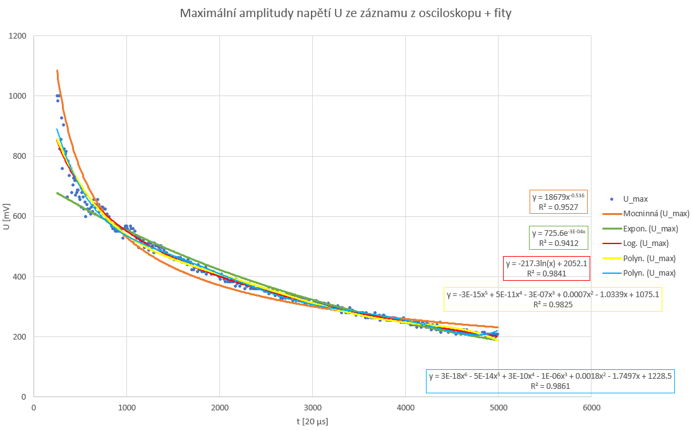
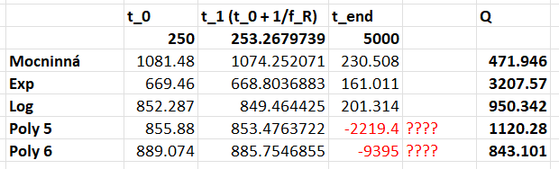

## Restituce:
Po vyčtení z videa:

https://www.quora.com/What-is-the-maximum-height-of-an-object-thrown-vertically-upward
https://en.wikipedia.org/wiki/Coefficient_of_restitution

$$
h_0 = \frac{v_0^2}{2g} \\
v_0 = \sqrt{2h_0g} \\ \ \\

h_1 = \frac{v_1^2}{2g} \\
v_1 = \sqrt{2h_1g} \\ \ \\

e = \frac{v_1}{v_0} = \sqrt{\frac{2h_1g}{2h_0g}} = \sqrt{\frac{h_1}{h_0}} = ( 0.715 \pm 0.00639 )
$$

<u>**Hodnotu mám, odchylku asi spíše ignorujte.**</u>

## Q faktor:
Nejdříve jsme data z osciloskopu obrátili absolutní hodnotou a vybrali lokální maxima (každých 10 samplů jsme vybrali maximum z 10 následujích samplů). Tím jsme získali přibližný průběh maximální amplitudy v čase. Z toho jsme našli poločas. 
https://en.wikipedia.org/wiki/Q_factor

$$
Q = 2\pi \cdot \frac{\text{energy stored}}{\text{energy dissipated}} \\ \ \\
E \propto y^2 \propto U^2 \\ \ \\
$$

### Možnost 1:
Z poločasu získáme počet kmitů ($n$) na ztrátu poloviny amplitudy (3/4 energie). 
U $Q_0$ počítáme ztrátu energie jako **průměrnou** ztrátu energie za jedno periodu, což je vzhledem k nelineárnímu chování měření nepřesné.

$$
t_{half} = ( 920.0 \pm 20.0 ) \ samples = ( 0.0184 \pm 0.0004 ) \ s \\
f_R = ( 15300.0 \pm 100.0 ) \ Hz \\
n = f_R \cdot t_{half} = ( 281.52 \pm 7.96 ) \\ \ \\

Q_0 = 2\pi \cdot \frac{1^2}{(1^2 - \frac{1}{2}^2) \cdot \frac{1}{n}} = ( 2358.456 \pm 66.686 )
$$

### Možnost 2:
Fitneme graf maxim nějakou funkcí, která cca odpovídá (taktika: vyzkoušíme všechny fity v excelu, vybereme si ten, co bajvoko vypadá nejlépe anebo má nejlepší $R^2$) (viz ferrite_15kHz_Q_REDUCED.xlsx). Já jsem si pro příklad vybral logaritmickou, protože se mi líbí, dosadil hodnoty pro $t=0$ a $t=\frac{1}{f_R}$ (kde nulu máme na samplu 250) a dopočítal $Q_1$:

$$
% U_{max}(t) \approx 
%   3\cdot10^{-18}x^6 
% - 5\cdot10^{-14}x^5 
% + 3\cdot10^{-10}x^4
% - 1\cdot10^{-6}x^3 \\  
% + 0.0018x^2
% - 1.7497x 
% + 1228.5 \\ \ \\
U_{max}(t) \approx = -217.3\ln(x) + 2052.1 \\ \ \\

U_0 = U_{max}(250 \text{ samples}) = 852.287 \\
U_1 = U_{max}\Bigl(250 \text{ samples} + \frac{1}{f_R} \Bigr) = 849.464 \\ \ \\

Q_1 = 2\pi \cdot \frac{U_0^2}{U_0^2 - U_1^2} \approx 950.342
$$

Porovnání s ostatními fity:
<u>**(nevím, proč fity Poly5 a Poly6 na konci jdou úplně mimo??? možná nějaká excelovská magie se zaokrouhlováním???)**</u>

<u>**Který z těchto výsledků byste tedy řekl, že je "správný"?**</u>

## Buzení
<u>**Předpokládám, že $f_L = \frac{1}{2}f_R$, protože závislost elongace vs čas odpovídá velmi zhruba $|\sin(t)|$, kdežto střídavý proud odpovídá $\sin(t)$?**</u> Míra magnetostrikce je sice malá, ale díky vysoké jakosti $Q$ se jednotlivé instance buzení nasčítají (až k mezi pevnosti feritu).

## Kontakt kuličky
Podle https://en.wikipedia.org/wiki/Contact_mechanics :

$$
F = \frac{4}{3}E^*\sqrt{R} \cdot \sqrt{d^3} \\

W = \int{F} \,dd = \frac{2}{5} \cdot \frac{4}{3}E^*\sqrt{R} \cdot \sqrt{d^5}
$$

Pro kuličku s polohovou energií $E_P$:

$$
E_P = mgh \\
E_P = W \\ \ \\
mgh = \frac{2}{5} \cdot \frac{4}{3}E^*\sqrt{R} \cdot \sqrt{d^5} \\ \ \\
d = \frac{(\frac{5}{2} \cdot \frac{3}{4} \cdot mgh)^2}{{E^*}^2 \cdot R}
$$

<u>**Ve Vašem rozboru zmiňujete "lineární závislost" mezi $d$ a $R$. Předpokládám, že myslíte právě toto. Jenom bych se chtěl ujistit, že zároveň myslíte lineární a nepřímou závislost/úměru? Z toho bychom mohli vypočítat nějakou mezní velikost kuličky, pro kterou by náš model fungoval?: Nebo jsem nepochopil užitečnost této informace?**</u>

<u>**Zároveň zmiňujete, že rychlost tyčky vyroste z 0% na 100% za čtvrtinu periody - to myslím, že odpovída, ale trochu mne to zarazilo, protože funkce $\sin{x}$ polovinu času roste, polovinu klesá. Stejně i derivace (což by mělo odpovídat rychlosti): $\frac{d}{dx} \sin{kx}=k\cos{kx}$. Nebylo by pro nás tedy důležitá polovina periody, jako doba, kdy je rychlost v kladném/záporném směru? I pro $|sin(x)|$, pokud máme frekvenci $f_R = 15.3kHz$, z které jste asi vypočítal $\frac{1}{4}\cdot\frac{1}{f_R} = 16\mu s$. Nebylo by tedy správně spíše: $\frac{1}{2}\cdot\frac{1}{f_R} = \frac{1}{4}\cdot\frac{1}{f_L} = 32\mu s$?**</u>

<u>**Předpokládám, že dopočet času deformace jste provedl jesnoduše takto: $t = \frac{2d}{v}$ (dvojnásobek $d$, protože musíme započítat i deformaci, i opačné vrácení do původního stavu)?**</u>

## Simulace a model

Zatím vše jasné, koeficient restituce už máme.

## Maximální amplituda

Průměrná amplituda $|y_{max}\sin{x}|$:

$$
\overline{y} 
= \frac{ \int_a^b y_{max}|\sin{x}| dx }{b-a} 
= \frac{ \int_0^\pi y_{max}|\sin{x}| dx }{\pi-0} 
= \frac{2}{\pi} \cdot y_{max}
$$

Síla v tahu působící na střed tyče kvůli kmitání <u>**jedné poloviny**</u>:

$$
F = m*a_0 \\
a_0 = \omega^2 y_0 \\ \ \\
F_{max} = \frac{1}{2} \rho S l \cdot \omega^2 y_{max} \\ \ \\
\overline{F} = \frac{1}{2} \rho S l \cdot \omega^2 \overline{y} 
= \frac{1}{2} \rho S l \cdot \omega^2 \cdot \frac{2}{\pi} \cdot y_{max}
= \rho S l \cdot \frac{\omega^2y_{max}}{\pi}
$$

<u>**Ve vašem rozboru jste vypočítal maximální amplitudu pro mez pevnosti $\sigma_{max} = 40MPa$ jako $18 \mu m$. K tomuto výpočtu jsme se nakonec také dostal:**</u>

$$
F_{max} = S\sigma_{max} \\ 
\overline{F} = \rho S l \cdot \frac{\omega^2y_{max}}{\pi} \\ \ \\

F_{max} = \overline{F} \\
\text{vysvětlení pro toto je v textu níže} \\
y_{max} = \pi \frac{\sigma_{max}}{l \rho \omega^2}
$$

<u>**U čeho si nejsem jistý, je, proč započítáváme $F_{max}$ pouze jednou? Nepůsobí na střed tyče stejnou silou i druhá polovina? Neměli bychom počítat $y_{max}$ s $2F_{max} = S\sigma_{max}$?**</u>

<u>**Druhá věc, u které si nejsem jistý, je, jestli jste nezaměnil $\overline{F}$ a $F_{max}$? Ve výpočtu výše jsem je schválně zaměnil a získal jsem stejný výsledek, co Vy. Nebylo by tedy správně?:**</u>

$$
2F_{max} = S\sigma_{max} \\
2\frac{1}{2} \rho S l \cdot \omega^2 y_{max} = S\sigma_{max} \\
y_{max} = \frac{\sigma_{max}}{l \rho \omega^2}
$$

## Mez pevnosti

<u>**Místa roztržení tyče jsou mi jasné z vysvětlení ve škole. Obrázek do prezentace doplním :)**</u>

