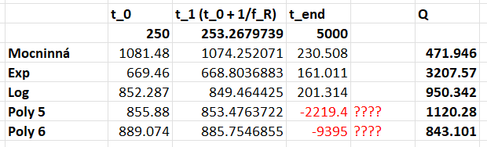

## Restituce:

Po vyčtení z videa:

https://www.quora.com/What-is-the-maximum-height-of-an-object-thrown-vertically-upward
https://en.wikipedia.org/wiki/Coefficient_of_restitution

$$
h_0 = \frac{v_0^2}{2g} \\
v_0 = \sqrt{2h_0g} \\ \ \\

h_1 = \frac{v_1^2}{2g} \\
v_1 = \sqrt{2h_1g} \\ \ \\

e = \frac{v_1}{v_0} = \sqrt{\frac{2h_1g}{2h_0g}} = \sqrt{\frac{h_1}{h_0}} = ( 0.715 \pm 0.00639 )
$$

<u>**Hodnotu mám, odchylku asi spíše ignorujte.**</u>

## Q faktor:

Nejdříve jsme data z osciloskopu obrátili absolutní hodnotou a vybrali lokální maxima (každých 10 samplů jsme vybrali maximum z 10 následujích samplů). Tím jsme získali přibližný průběh maximální amplitudy v čase. Z toho jsme našli poločas.
https://en.wikipedia.org/wiki/Q_factor

$$
Q = 2\pi \cdot \frac{\text{energy stored}}{\text{energy dissipated}} \\ \ \\
E \propto y^2 \propto U^2 \\ \ \\
$$

### Možnost 1:

Z poločasu získáme počet kmitů ($n$) na ztrátu poloviny amplitudy (3/4 energie).
U $Q_0$ počítáme ztrátu energie jako **průměrnou** ztrátu energie za jedno periodu, což je vzhledem k nelineárnímu chování měření nepřesné.

$$
t_{half} = ( 920.0 \pm 20.0 ) \ samples = ( 0.0184 \pm 0.0004 ) \ s \\
f_R = ( 15300.0 \pm 100.0 ) \ Hz \\
n = f_R \cdot t_{half} = ( 281.52 \pm 7.96 ) \\ \ \\

Q_0 = 2\pi \cdot \frac{1^2}{(1^2 - \frac{1}{2}^2) \cdot \frac{1}{n}} = ( 2358.456 \pm 66.686 )
$$

### Možnost 2:

Fitneme graf maxim nějakou funkcí, která cca odpovídá (taktika: vyzkoušíme všechny fity v excelu, vybereme si ten, co bajvoko vypadá nejlépe anebo má nejlepší $R^2$) (viz ferrite_15kHz_Q_REDUCED.xlsx). Já jsem si pro příklad vybral logaritmickou, protože se mi líbí, dosadil hodnoty pro $t=0$ a $t=\frac{1}{f_R}$ (kde nulu máme na samplu 250) a dopočítal $Q_1$:

$$
% U_{max}(t) \approx
%   3\cdot10^{-18}x^6
% - 5\cdot10^{-14}x^5
% + 3\cdot10^{-10}x^4
% - 1\cdot10^{-6}x^3 \\
% + 0.0018x^2
% - 1.7497x
% + 1228.5 \\ \ \\
U_{max}(t) \approx = -217.3\ln(x) + 2052.1 \\ \ \\

U_0 = U_{max}(250 \text{ samples}) = 852.287 \\
U_1 = U_{max}\Bigl(250 \text{ samples} + \frac{1}{f_R} \Bigr) = 849.464 \\ \ \\

Q_1 = 2\pi \cdot \frac{U_0^2}{U_0^2 - U_1^2} \approx 950.342
$$

Porovnání s ostatními fity:

<!-- <u>**(nevím, proč fity Poly5 a Poly6 na konci jdou úplně mimo??? možná nějaká excelovská magie se zaokrouhlováním???)**</u> -->

<!-- <u>**Který z těchto výsledků byste tedy řekl, že je "správný"?**</u> -->

### Možnost 3:

Odebereme Začátek dat, protože se v nich projevují
Přes alternativní definici $Q$:

$$
Q = \frac{E}{\frac{dE}{d\varphi}} \\ \ \\
\frac{dE}{E} = \frac{d\varphi}{Q} \\ \ \\
Q = \frac{\varphi}{\ln{E}} = \frac{\varphi}{\ln{U^2}} \\ \  \\
$$

Poté dopočet přes výběr 2 míst a optimalizaci parametrů pro defininci funkce napětí jako tlumeného oscilátoru:

$$
u(t) = U_{max} e^{-\lambda t} \sin(\omega t + \varphi_0)
 = U_{max} e^{-\lambda t} \sin(2\pi f_R t + \varphi_0) \\ \ \\
Q_2 = \frac{\varphi_1 - \varphi_2}{\ln U_1^2 - \ln U_2^2}
= \frac{2\pi f_R (t_1-t_2)}{\ln \Bigl( \bigl(\frac{U_1}{U_2}\bigr)^2 \Bigr)}  \\
Q_2 \approx 4135
$$

## Buzení

Míra magnetostrikce je sice malá, ale díky vysoké jakosti $Q$ se jednotlivé instance buzení nasčítají (až k mezi pevnosti feritu). $f_L = \frac{1}{2} f_R$, protože magnetostrikce je kinda jako $|\sin(x)|$ 

## Kontakt kuličky

Podle https://en.wikipedia.org/wiki/Contact_mechanics :

$$
F = \frac{4}{3}E^*\sqrt{R} \cdot \sqrt{d^3} \\ \ \\

E^* = \frac{1}{\frac{1-\nu_1^2}{E_1} + \frac{1-\nu_2^2}{E_2}} \\ \ \\

W = \int{F} \,dd = \frac{2}{5} \cdot \frac{4}{3}E^*\sqrt{R} \cdot \sqrt{d^5}
$$

Pro kuličku s polohovou energií $E_P$:

$$
E_P = mgh \\
E_P = W \\ \ \\
mgh = \frac{2}{5} \cdot \frac{4}{3}E^*\sqrt{R} \cdot \sqrt{d^5} \\ \ \\
d^5 = \frac{(\frac{5}{2} \cdot \frac{3}{4} \cdot mgh)^2}{{E^*}^2 \cdot R} \\ \ \\
d = R \sqrt[5]{h^2} \sqrt[5]{
    \Biggl(\frac{(\frac{5}{2} \cdot \pi \rho g)}{E^*}\Biggr)^2} \\ \ \\
t = \frac{2d}{v} \\ \ \\

t = \frac{2R \sqrt[5]{h^2} \sqrt[5]{
    \Bigl(\frac{(\frac{5}{2} \cdot \pi \rho g)}{E^*}\Bigr)^2}}
    {\sqrt{2gh}}
$$

<u>**Z toho bychom mohli vypočítat nějakou mezní velikost kuličky, pro kterou by náš model fungoval?: Nebo jsem nepochopil užitečnost této informace?**</u>

<u>**Zároveň zmiňujete, že rychlost tyčky vyroste z 0% na 100% za čtvrtinu periody - to myslím, že odpovída, ale trochu mne to zarazilo, protože funkce $\sin{x}$ polovinu času roste, polovinu klesá. Stejně i derivace (což by mělo odpovídat rychlosti): $\frac{d}{dx} \sin{kx}=k\cos{kx}$. Nebylo by pro nás tedy důležitá polovina periody, jako doba, kdy je rychlost v kladném/záporném směru? I pro $|sin(x)|$, pokud máme frekvenci $f_R = 15.3kHz$, z které jste asi vypočítal $\frac{1}{4}\cdot\frac{1}{f_R} = 16\mu s$. Nebylo by tedy správně spíše: $\frac{1}{2}\cdot\frac{1}{f_R} = \frac{1}{4}\cdot\frac{1}{f_L} = 32\mu s$?**</u>

## Simulace a model

### Pohyb kuličky v čase:

$$
y_{ball}(t) = y_0 + v_0t - \frac{1}{2}gt^2 \\
v_{ball}(t) = v_0 - gt
$$

### Pohyb feritu v čase:
<!-- $f(x)$ označuje specifickou deformační křivku ($\lambda$-$H$ závislost) pro magnetostrikci. $F(x)$ označuje specifickou deformační křivku ($\lambda$-$H$ závislost) pro magnetostrikci, ale pouze pro nějaký specifikovaný úsek ($x \in \langle-1;1 \rangle, F(x) \in \langle 0; 1 \rangle $) -->

$$
% u(t) = U \cos(2\pi f_L \cdot t) \\
% y_{fer}(t) = f \bigg(\frac{u(t)}{2\pi rR} \bigg) \cdot \frac{l}{2}
% \equiv y_{max} F(\cos(2\pi f_L t)) \\
y_{fer}(t) = y_{max}\cos(\omega_R t) \\
v_{fer}(t) = \frac{dy(t)}{dt} = - y_{max} \omega_R \sin(\omega_R t)
% H \propto \cos(t) \\
% \frac{\Delta L}{L} = f(H)
$$

<!-- `sim1.js` využívá: 
$$
F(x)=|x| \\
y_{fer}(t) = y_{max} |\cos(\omega_L t)|\\
v_{fer}(t) = -y_{max}\omega_L\sin(\omega_L t)\text{sgn}(\cos(\omega_L t))
$$

`sim2.js` využívá: 
$$
F(x)=\sqrt{|x|} \\
y_{fer}(t) = y_{max} \sqrt{|\cos(\omega_L t)|}\\
v_{fer}(t) = -\frac{1}{2} y_{max} \omega_L \tan(\omega_L t) \sqrt{|cos(\omega_L t)|}
$$ -->

### Kolize:

Pro $v_f > 0$:
$$
v_k' = e\cdot(v_f - v_k) + v_f
$$

Pro $v_f < 0$:
$$
v_k' = e \cdot(v_f - v_k)
$$

### Heuristická optimalizace:

Velká část letu kuličky bude probíhat relativně daleko od feritu, pro ušetření výpočetní kapacity a snížení akumulované chyby můžeme celý let přeskočit až k bodu, kdy se teprve může kolize objevit. To je když $y \in \langle \pm y_{max} \rangle$. Tento časový úsek zle vypočítat:
$$
y_{max} = -\frac{1}{2}gt^2 + v_0t + y_0 \\ \ \\
t_{min} = \frac{v_0 + \sqrt{v_0^2+2g\cdot(y_0 - y_{max})}}{g} 
$$

## Maximální amplituda

Průměrná amplituda $|y_{max}\sin{x}|$:

$$
\overline{y}
= \frac{ \int_a^b y_{max}|\sin{x}| dx }{b-a}
= \frac{ \int_0^\pi y_{max}|\sin{x}| dx }{\pi-0}
= \frac{2}{\pi} \cdot y_{max}
$$

Síla v tahu působící na střed tyče kvůli kmitání:

$$
F = m*a_0 \\
a_0 = \omega^2 y_0 \\ \ \\
F_{max} = \frac{1}{2} \rho S l \cdot \omega^2 y_{max} \\ \ \\
\overline{F} = \frac{1}{2} \rho S l \cdot \omega^2 \overline{y}
= \frac{1}{2} \rho S l \cdot \omega^2 \cdot \frac{2}{\pi} \cdot y_{max}
= \rho S l \cdot \frac{\omega^2y_{max}}{\pi}
$$

<u>**Ve vašem rozboru jste vypočítal maximální amplitudu pro mez pevnosti $\sigma_{max} = 40MPa$ jako $18 \mu m$. K tomuto výpočtu jsme se nakonec také dostal:**</u>

$$
F_{max} = S\sigma_{max} \\
F_{max} = \rho S l \cdot \frac{\omega^2y_{max}}{\pi} \\ \ \\
y_{max} = \pi \frac{\sigma_{max}}{l \rho \omega^2}
$$

## Mez pevnosti

<u>**Místa roztržení tyče jsou mi jasné z vysvětlení ve škole. Obrázek do prezentace doplním :)**</u>
