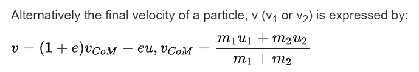

Vak
    - Nepružný
    - Nehmotný (vůči objekty)
    - Indence či co pro udržení objektu na vaku
    - Pohyb objektu x a objektu y jsou nezávislý na sebe
      - Závislot jen přes tlak, nepůsobí na sebe přes prohnutí vaku
      - Vak mnohem delší v jednom směru, než ve druhém

Mikroten
    - slabina - hrany (folds) - zalepit izolepou

Dokonale pružný ráz (to co simulujeme)
    - m1/m2 = 1    -> energie 1 => 1
    - m1/m2 = 2    -> energie 1 => 16/18
    - m1/m2 = 1    -> energie 1 => 
    - m1/m2 = 1    -> energie 1 => 

dokonale pružný znamená $e = 1$