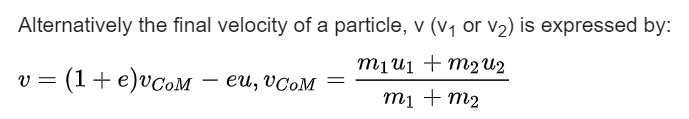

Vak
    - Nepružný
    - Nehmotný (vůči objekty)
    - Indence či co pro udržení objektu na vaku
    - Pohyb objektu x a objektu y jsou nezávislý na sebe
      - Závislot jen přes tlak, nepůsobí na sebe přes prohnutí vaku
      - Vak mnohem delší v jednom směru, než ve druhém

Mikroten
    - slabina - hrany (folds) - zalepit izolepou

dokonale pružný je pro $e = 1$